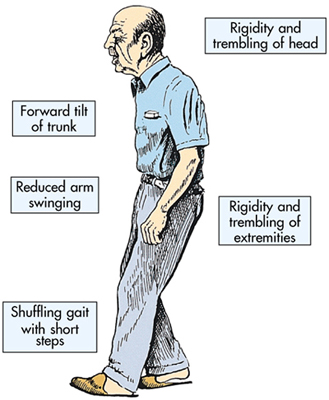

# FEUP-IART

A repository to host IART projects.

##  Parkinson's disease

Parkinson's disease (PD) is a degenerative disorder of the central nervous system.

Early in the course of the disease, the most obvious symptoms are movement-related; these include shaking, rigidity, slowness of movement and difficulty with walking and gait.

Later, thinking and behavioral problems may arise, with dementia commonly occurring in the advanced stages of the disease, whereas depression is the most common psychiatric symptom.

## Parkinson's disease speech data set

[UCI Machine Learning Repository][2] provides multiple types of sound recordings of Parkinson speech.

### Data Set Information

The PD database consists of **training** and **test** files.

Further details are contained in the following reference. If you use the dataset, please cite: 
Erdogdu Sakar, B., Isenkul, M., Sakar, C.O., Sertbas, A., Gurgen, F., Delil, S., Apaydin, H., Kursun, 
O., 'Collection and Analysis of a Parkinson Speech Dataset with Multiple Types of Sound 
Recordings', IEEE Journal of Biomedical and Health Informatics, vol. 17(4), pp. 828-834, 2013 

#### Training data

The training data contains **40 entries**:

- **20** ill individuals
  - **6** female 
  - **14** male 

- **20** healthy individuals
  - **10** female 
  - **10** male 

Multiple types of sound recordings (26 voice samples including sustained vowels, numbers, words and short sentences) are take from all subjects. A group of 26 linear and time frequency based features are extracted from each voice sample. The UPDRS score of each patient (which is determined by an expert physician) is also available in the dataset. Therefore, this dataset can also be used for regression. 

##### File contents

Each subject has 26 voice samples including sustained vowels, numbers, words and short 
sentences. The voice samples in the training data file are given in the 
following order: 

sample# - corresponding voice samples 
1: sustained vowel (aaa……) 
2: sustained vowel (ooo…...) 
3: sustained vowel (uuu…...) 
4-13: numbers from 1 to 10 
14-17: short sentences 
18-26: words

##### Training data syntax

| Column 0   |
|:----------:|
| Subject ID |
|          1 |

| Column 1       | Column 2                 | Column 3     | Column 4      | Column 5     |
|:--------------:|:------------------------:|:------------:|:-------------:|:------------:|
| Jitter (local) | Jitter (local, absolute) | Jitter (rap) | Jitter (ppq5) | Jitter (ddp) |
| 1.488          | 0.000090213              | 0.9          | 0.794         | 2.699        |

| Column 6        | Column 7            | Column 8       | Column 9       | Column 10       | Column 11     |
|:---------------:|:-------------------:|:--------------:|:--------------:|:---------------:|:-------------:|
| Shimmer (local) | Shimmer (local, dB) | Shimmer (apq3) | Shimmer (apq5) | Shimmer (apq11) | Shimmer (dda) |
| 8.334           | 0.779               | 4.517          | 4.609          | 6.802           | 13.551        |

features 12-14: AC,NTH,HTN, 
features 15-19: Median pitch,Mean pitch,Standard deviation,Minimum pitch,Maximum pitch, 
features 20-23: Number of pulses,Number of periods,Mean period,Standard deviation of period, features 24-26: Fraction of locally unvoiced frames,Number of voice breaks,Degree of voice breaks 

column 28: UPDRS 
column 29: class information 

#### Test data

After collecting the training dataset which consists of multiple types of sound recordings and performing our experiments, in line with the obtained findings we continued collecting an independent test set from PWP via the same physician's examination process under the same conditions. During the collection of this dataset, 28 PD patients are asked to say only the sustained vowels 'a' and 'o' three times respectively which makes a total of 168 recordings. The same 26 features are extracted from voice samples of this dataset. This dataset can be used as an independent test set to validate the results obtained on training set. 

##### File contents

28 PD patients are asked to say only the sustained vowels 'a' and 'o' three times respectively which makes a total of 168 recordings (each subject has 6 voice samples) The voice samples in the test data file are given in the following order: 

sample# - corresponding voice samples 
1-3: sustained vowel (aaa……) 
4-6: sustained vowel (ooo……) 

#### Test Data syntax

column 1: Subject id 

colum 2-27: features 
features 1-5: Jitter (local),Jitter (local, absolute),Jitter (rap),Jitter (ppq5),Jitter (ddp), 
features 6-11: Shimmer (local),Shimmer (local, dB),Shimmer (apq3),Shimmer (apq5), Shimmer (apq11),Shimmer (dda), 
features 12-14: AC,NTH,HTN, 
features 15-19: Median pitch,Mean pitch,Standard deviation,Minimum pitch,Maximum pitch, 
features 20-23: Number of pulses,Number of periods,Mean period,Standard deviation of period, 
features 24-26: Fraction of locally unvoiced frames,Number of voice breaks,Degree of voice breaks 

column 28: class information 

## Parkinson's disease diagnosis application

## Abbreviation meanings

PWP - People with Parkinson's disease  
UPDRS - Unified Parkinson's Disease Rating Scale

## References

- http://en.wikipedia.org/wiki/Parkinson%27s_disease
- http://archive.ics.uci.edu/ml/datasets/Parkinson+Speech+Dataset+with++Multiple+Types+of+Sound+Recordings

[1]: http://en.wikipedia.org/wiki/Parkinson%27s_disease
[2]: http://archive.ics.uci.edu/ml/datasets/Parkinson+Speech+Dataset+with++Multiple+Types+of+Sound+Recordings
